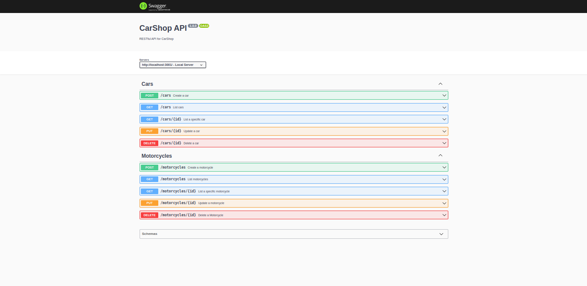

# CarShop API
A Restful API for CRUD operations simulating a vehicle shop

## Contents
- [Overview](#overview)
    - [How to Run](#how-to-run)
    - [The Challenge](#the-problem)
    - [Images](#images)
    - [Links](#links)
  - [My process](#my-process)
    - [Built with](#built-with)
    - [Learnings](#learnings)
- [Author](#author)

## Overview

### The Challenge

The Carshop API was built to practice and improve my skills in TypeScript, Express, MongoDB, Mongoose,
RESTful API'S, tests and API documentation.

__Users should able to?__
- Create a vehicle
- Search for vehicles or a specific vehicle
- Update a vehicle
- Delete a vehicle

### Images

<small>API Docs</small>

### Links

- Docs URL: https://carshop-123.herokuapp.com/docs/

## My process

### Built with

- TypeScript
- Node.js
- Express.js
- Mongoose
- MongoDB
- Mocha, Chai and Sinon
- Swagger

### What i've learned

First, I was able to practice TDD as a development method, using Chai, Mocha & Sinon, as well as improve my knowledge of RESTFUL API's with Node.js, Express, Non-Relational databases with MongoDB and ODM's with Mongoose.